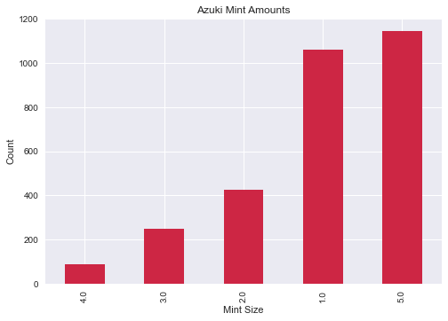
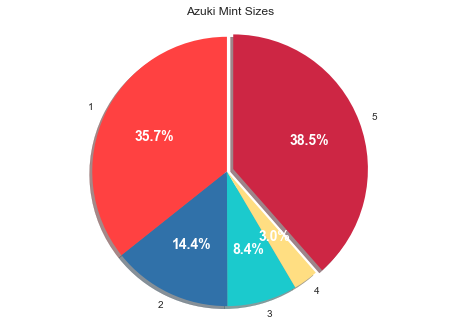

# Azuki Mint Stats

CSV data pulled from the transactions of the Azuki contract on etherscan: https://etherscan.io/address/0xed5af388653567af2f388e6224dc7c4b3241c544

## TLDR

Average Gas Price for successful transactions: 0.0499

Total successful transactions: 2972

Total ETH sent: 8746.0

Number of unique addresses in mint: 2891

Total Gas on successful transactions ETH: 148.42119670070483

Total Gas on failed transactions in ETH 22.982565510737544

Total Gas Fees: 171.40376221144237

Number of transactions that Reverted: 1965

Total number of ETH that tried to Mint: 3703.0

## Distribution of Mint Sizes:

